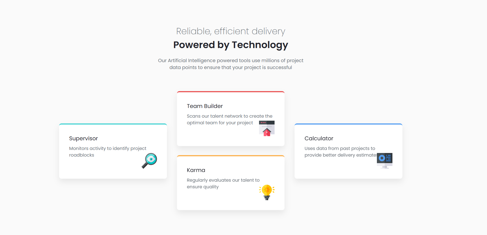
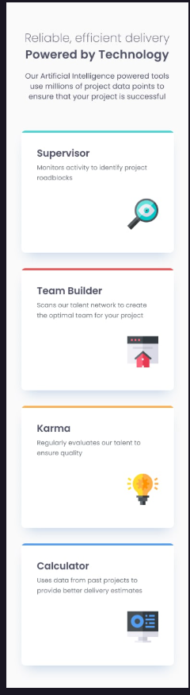

# 🚀 Projeto 4 Cards - Powered by Technology

Uma landing page simples e moderna criada para apresentar quatro seções principais, cada uma representando uma área diferente de um projeto.  
O design é inspirado em um desafio do **Frontend Mentor**, com foco em organização, uso de **CSS Grid** e **responsividade**.

## 💻 Preview do Projeto (Desktop)

## ⚙️ Funcionalidades

- Layout estruturado em **CSS Grid** para melhor organização dos cards  
- Design limpo e moderno, com foco em **hierarquia visual**  
- Uso de **cores temáticas** para diferenciação de seções  
- Sombras sutis e espaçamentos bem trabalhados  
- Totalmente **responsivo**, adaptando-se a diferentes tamanhos de telas

## 📱 Preview do Projeto (Mobile)

## 🧰 Tecnologias Utilizadas

- **HTML5** – Estrutura semântica e bem organizada  
- **CSS3** – Estilização moderna com uso de variáveis  
- **Grid Layout** – Distribuição precisa dos elementos na tela

## 🧠 O que Aprendi

Esse foi meu primeiro projeto desenvolvido com apoio de **IA** — estou utilizando para deixar meus projetos mais rápidos e produtivos.  
Durante o desenvolvimento, aprendi muito sobre:  
- Organização de layout com **CSS Grid**  
- Como usar **IA de forma estratégica** para aumentar a produtividade  
- Melhorar a **agilidade**, **clareza** e **consistência** do código  
- Pensar de forma mais **lógica e otimizada** em cada parte do projeto

## 🙌 Créditos

Este projeto foi desenvolvido com base em um desafio do [Frontend Mentor](https://www.frontendmentor.io).  
A proposta ajuda no aperfeiçoamento de habilidades em HTML, CSS e boas práticas de layout responsivo.

## 👨‍💻 Autor

Desenvolvido por **Eduardo** como parte do aprendizado em desenvolvimento front-end.  
Sinta-se à vontade para contribuir ou se inspirar para seus próprios estudos