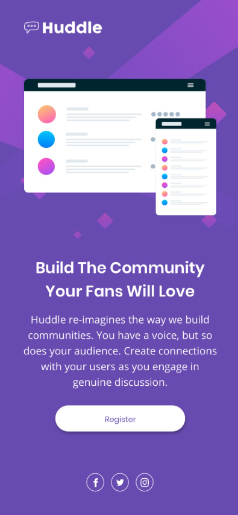

# 🌐 Huddle Landing Page

Landing page desenvolvida com **HTML e CSS**, inspirada no desafio **[Frontend Mentor](https://www.frontendmentor.io/)**.  
O projeto simula a página inicial da plataforma **Huddle**, com foco em layout responsivo e boas práticas de semântica e estilização.

## 📸 Prévia do projeto

## 🎯 Objetivo do projeto

O desafio consistia em recriar o layout proposto pela Frontend Mentor de forma fiel,  
trabalhando conceitos como:

- Estrutura **HTML semântica**
- Uso de **variáveis CSS**
- Aplicação do **modelo mobile-first**
- Criação de layout **responsivo**
- Manipulação de **backgrounds e imagens responsivas**
- Aplicação de **hover states**
## 🧩 Tecnologias utilizadas

- **HTML5** (semântico)
- **CSS3**
  - Variáveis
  - Flexbox
  - Responsividade com media queries
  - Fontes do Google Fonts (`Karla`)
- **Font Awesome** (para ícones)

## 📱 Responsividade

O layout foi desenvolvido de forma responsiva para diferentes tamanhos de tela:
- **Desktop:** 
- **Mobile**

## 📸 Prévia do projeto mobile

## 🙌 Créditos

Este projeto foi desenvolvido com base em um desafio do [Frontend Mentor](https://www.frontendmentor.io).  
A proposta ajuda no aperfeiçoamento de habilidades em HTML, CSS e boas práticas de layout responsivo.

## 👨‍💻 Autor

Desenvolvido por **Eduardo** como parte do aprendizado em desenvolvimento front-end.  
Sinta-se à vontade para contribuir ou se inspirar para seus próprios estudos