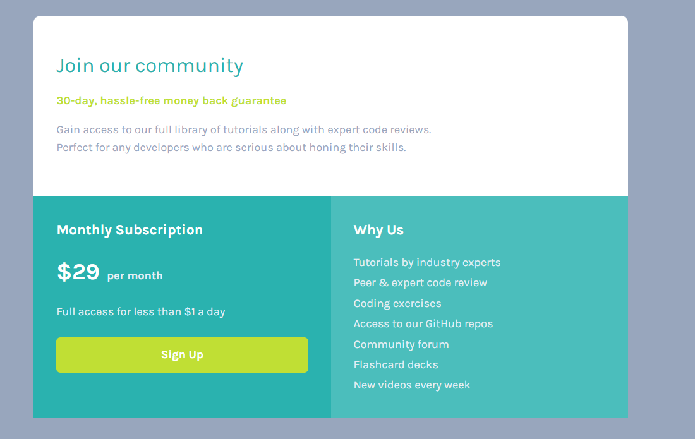
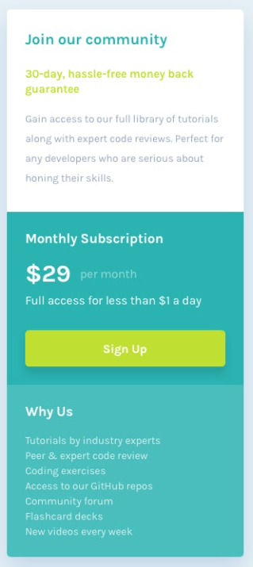

# 💻 Projeto: Grade de Preço

Uma landing page moderna e responsiva apresentando um **cartão de assinatura** com foco em conversão e clareza visual.  
O design foi inspirado em desafios do [Frontend Mentor](https://www.frontendmentor.io/), com personalização e aprimoramentos feitos por mim.

## 📸 Preview do Projeto Desktop

## 📸 Preview do Projeto Mobile

## 🚀 Funcionalidades

- Estrutura **HTML semântica**, organizada e acessível.  
- Layout construído com **Flexbox** para garantir responsividade e alinhamento preciso.  
- Uso de **variáveis CSS** para facilitar a manutenção e consistência visual.  
- **Botão interativo** com efeito de clique (JavaScript toggle).  
- Estilo limpo e harmônico, com boa hierarquia tipográfica e espaçamento equilibrado.  

## 💡 Desafios Enfrentados

Esse projeto foi desenvolvido com apoio de **IA** — estou utilizando para deixar meus projetos mais rápidos e produtivos.  
Durante o desenvolvimento, aprendi muito sobre:  
- Organização de layout com **CSS Grid**  
- Como usar **IA de forma estratégica** para aumentar a produtividade  
- Melhorar a **agilidade**, **clareza** e **consistência** do código  
- Pensar de forma mais **lógica e otimizada** em cada parte do projeto

## 📚 O que Aprendi

Esse projeto me ajudou a consolidar boas práticas em **HTML e CSS**, especialmente:

- Organização modular de arquivos (reset, variables, base, layout, components);
- Aplicação de **Flexbox** em estruturas de grid simples;
- Uso de **cores via variáveis CSS** para escalabilidade;
- Melhoria na **semântica e acessibilidade** do HTML;

## 🧩 Tecnologias Utilizadas

- **HTML5**
- **CSS3**
- **Google Fonts**

## 🙌 Créditos

Este projeto foi desenvolvido com base em um desafio do [Frontend Mentor](https://www.frontendmentor.io).  
A proposta ajuda no aperfeiçoamento de habilidades em HTML, CSS e boas práticas de layout responsivo.

## 👨‍💻 Autor

Desenvolvido por **Eduardo** como parte do aprendizado em desenvolvimento front-end.  
Sinta-se à vontade para contribuir ou se inspirar para seus próprios estudos